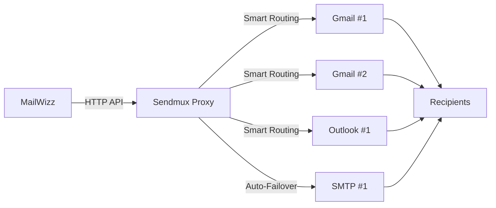

  <picture>
    <source
      media="(prefers-color-scheme: dark)"
      srcset="https://raw.githubusercontent.com/Sendmux/mailwizz-smtp-proxy/main/.github/assets/logo-dark.svg"
    />
    <source
      media="(prefers-color-scheme: light)"
      srcset="https://raw.githubusercontent.com/Sendmux/mailwizz-smtp-proxy/main/.github/assets/logo-light.svg"
    />
    
  </picture>

# MailWizz Email Delivery Extension
## for Sendmux HTTP/SMTP Email Proxy

Connect [MailWizz](https://www.mailwizz.com/) to [Sendmux](https://sendmux.ai) HTTP/SMTP Email Proxy — route emails through multiple SMTP providers with smart rate limiting, automatic failover, and bounce/complaint handling via webhooks.

📖 [Sendmux](https://sendmux.ai) | 📚 [Documentation](https://docs.sendmux.ai) | 📧 [Contact Support](mailto:contact@sendmux.ai)

---

## What Is Sendmux?

Sendmux is a smart email proxy that sits between your MailWizz instance and your SMTP providers (Gmail, Outlook, or any custom SMTP). It handles routing, rate limiting, failover, and delivery tracking — so you can focus on sending campaigns.

- **One API endpoint** routes to all your configured providers automatically
- **Smart rate limiting** randomizes sending patterns to look natural
- **Automatic failover** bypasses failed providers with zero downtime
- **100% delivery success** — every email is reliably queued and handed off to your designated providers
- **Bounce & complaint webhooks** are processed automatically back into MailWizz

## Who It's For

- **Cold Email Marketers** — scale outreach across multiple SMTP accounts with smart rate limiting to prevent provider bans
- **Cold Email Agencies** — manage client campaigns with per-account quotas, failover, and pay-as-you-go billing
- **Lead Generation Teams** — B2B outbound automation with multi-SMTP rotation and delivery tracking
- **SaaS Applications** — reliable transactional emails (password resets, notifications)
- **Marketing Teams** — campaign distribution across providers automatically
- **E-commerce Platforms** — order confirmations and shipping notifications with guaranteed delivery
- **Developers** — drop-in SMTP replacement or REST API integration

## Key Benefits

| Benefit | Details |
|---|---|
| 💰 **Affordable** | Send 1,000 emails for just a few cents. No monthly fees. [See pricing](https://sendmux.ai) |
| 🚀 **100% Delivery Success** | Reliable message queueing ensures every email is handed off to your providers |
| ⚡ **Built for Scale** | 10+ million emails/day capacity, 1,000+ emails/sec at peak |
| 🤖 **Human-Like Sending** | Randomized rate limits mimic natural sending behavior |
| 🎯 **Flexible Routing** | Percentage-based distribution, group routing, per-provider quotas |
| 🛡️ **Enterprise Security** | Encrypted credentials, TLS/SSL, DDoS protection, audit logging |
| 📊 **Full Visibility** | Real-time delivery tracking and provider performance metrics |
| ♻️ **Zero Downtime** | Automatic failover bypasses failed providers instantly |

## Requirements

| Requirement | Version |
|---|---|
| MailWizz | 2.0.0 or higher |
| PHP | 8.0 or higher |
| Sendmux account | [Free sign-up](https://app.sendmux.ai/sign-up) |

## Quick Start Guide

### 1. Create Your Sendmux Account (Free)
Sign up at [app.sendmux.ai/sign-up](https://app.sendmux.ai/sign-up)

### 2. Add Funds
Navigate to your team's **Billing** page via the sidebar navigation. Top up your account and/or configure auto top-up.

### 3. Configure Email Providers
- Open your project (or create a new one)
- Go to **Settings → Email Proxy** tab
- Click **Import Providers** to add your SMTP accounts
- Configure each provider:
  - Quotas (per second, minute, hour, day)
  - Tracking domain
  - From email, From name
  - Reply-to email, Reply-to name
  - Traffic percentage (100 = highest priority)

### 4. Generate a Sending API Key
- In the Sendmux dashboard, navigate to **API Keys** from the sidebar
- Click **Create API Key**
- Select **Sending Key** (used to send email via API, CLI, MCP, or AI agents)
- Give it a name and optional description
- Under **Sending via**, choose the scope:
  - **All active providers** (default) — routes through all your configured providers
  - **Specific providers** — restrict to selected providers only
  - **Delivery group(s)** — restrict to specific delivery groups
- Click **Create Key**
- Copy the generated API key (starts with `smx_`) — you'll need it for MailWizz

### 5. Install Extension in MailWizz
- [Download the extension](https://github.com/Sendmux/mailwizz-smtp-proxy/archive/refs/heads/main.zip) zip file to your computer
- In MailWizz, go to **/backend → Extend → Extensions → Upload Extension**
- Upload the zip file and click **Enable**

### 6. Create Delivery Server
- Go to **Delivery Servers → Create New**
- Select **Sendmux Web API** from the server type dropdown
- **Username**: Enter any value (not used for authentication)
- **API Key**: Paste the Sending Key from step 4
- Save the delivery server

### 7. Start Sending
Send campaigns through MailWizz as normal. View delivery logs in Sendmux via **Email Proxy → View Logs**.

## Features

### Supported Providers

**SMTP Email Accounts (Available Now)** — connect unlimited accounts from any provider:
- Gmail (Personal and Google Workspace)
- Outlook / Office 365
- Any custom SMTP provider (Mailgun, SparkPost, etc.)

**API Email Providers (Coming Soon)** — direct API integration:
SendGrid, Mailgun, Amazon SES, Resend, Postmark, SparkPost, Mailjet, Brevo, SMTP.com, SocketLabs, Elastic Email, Pepipost (Netcore), MailerSend

### Smart Routing & Delivery Groups

Organize email accounts into custom groups (Marketing, Transactional, Customer Support) and route emails intelligently using the `X-Delivery-Route` header:

- **Marketing Campaigns** — route through dedicated marketing providers
- **Transactional Emails** — send through high-priority transactional accounts
- **Customer Support** — separate support emails from bulk campaigns
- **Client Segregation** — agencies can isolate client campaigns for reputation management

### Human-Like Sending Patterns

Configure rate limit ranges (e.g., "2-3 per hour", "20-25 per day"). Sendmux randomizes the sending rate within your range every 5 minutes — mimicking natural human behavior to improve inbox placement.

### Bounce & Complaint Handling

This extension automatically processes webhook events from Sendmux:

| Event Type | Action |
|---|---|
| `delivery.dsn-perm-fail` | Hard bounce — logged and subscriber blacklisted |
| `delivery.dsn-temp-fail` | Soft bounce — logged |
| `delivery.failed` | Delivery failure — logged |
| `incoming-report.abuse-report` | Abuse complaint — subscriber blacklisted |
| `incoming-report.fraud-report` | Fraud report — subscriber blacklisted |

Webhook URL format: `https://yourdomain.com/dswh/sendmux-api/{server_id}`

### Dual Integration Options

- **SMTP Server** — standard port 587 and non-standard port 2525
- **HTTP REST API** — for programmatic sending

Same authentication works for both methods.

## Sendmux Platform

### APIs (Available Now)

Sendmux provides comprehensive APIs for both sending and managing your email infrastructure:

**[Sending API](https://docs.sendmux.ai/sending-api/introduction)** — send emails programmatically (this extension uses the Sending API under the hood):
- Send individual emails
- Send batch emails (up to multiple recipients in a single API call)

**[Management API](https://docs.sendmux.ai/api-reference/introduction)** — full control over your Sendmux account:
- Manage providers and provider settings
- View account balance and billing
- Access email delivery metrics and logs
- Configure routing rules and delivery groups

### Coming Soon

> 🤖 **MCP Server** — connect Sendmux to AI agents and LLM workflows via the Model Context Protocol
>
> 💻 **CLI** — manage providers, send emails, and view logs from the command line
>
> 📬 **Email Inboxes for AI Agents** — dedicated inboxes that AI agents can read, reply to, and act on autonomously

## FAQ

### How does Sendmux guarantee delivery?
Sendmux guarantees **100% delivery success** — meaning every email you send through the proxy is reliably queued and handed off to your designated SMTP providers. Actual inbox placement depends on your provider's reputation, domain configuration (SPF/DKIM/DMARC), and content.

### Do I need a separate bounce server in MailWizz?
No. This extension handles bounces and complaints automatically via webhooks. When Sendmux detects a bounce or complaint, it sends the event to your MailWizz webhook endpoint which processes it immediately.

### Can I use multiple SMTP providers at once?
Yes. Configure as many providers as you need in Sendmux, set traffic percentages and rate limits for each, and Sendmux routes emails across all of them automatically.

### What happens when a provider fails?
Sendmux automatically detects the failure and routes emails through your remaining active providers with zero downtime. No manual intervention required.

### Is the username field important?
No. Only the **Sending API Key** (password field) is used for authentication. The username field can be set to any value.

### What format does the API key use?
Sendmux Sending API keys start with `smx_`. You can create and manage them from the **API Keys** section in the Sendmux dashboard.

## License

[FSL-2.0](LICENSE) (Functional Source License 2.0)

---

[Get Started](https://sendmux.ai) | [Documentation](https://docs.sendmux.ai) | [Contact Support](mailto:contact@sendmux.ai)
