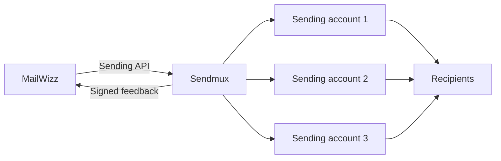

  <picture>
    <source
      media="(prefers-color-scheme: dark)"
      srcset="https://raw.githubusercontent.com/Sendmux/mailwizz-smtp-proxy/main/.github/assets/logo-dark.svg"
    />
    <source
      media="(prefers-color-scheme: light)"
      srcset="https://raw.githubusercontent.com/Sendmux/mailwizz-smtp-proxy/main/.github/assets/logo-light.svg"
    />
    
  </picture>

# Sendmux for MailWizz

Connect [MailWizz](https://www.mailwizz.com/) to [Sendmux](https://sendmux.ai) through the Sendmux Sending API. MailWizz manages lists, campaigns and autoresponders, while Sendmux routes accepted messages through the active sending accounts and limits configured for your team.

[Sendmux](https://sendmux.ai) | [Documentation](https://sendmux.ai/docs) | [Contact support](mailto:contact@sendmux.ai)

## What the extension does

- Sends MailWizz campaign and transactional messages through one Sendmux delivery server.
- Preserves MailWizz campaign and subscriber identifiers in the return path so feedback can be correlated.
- Adds a stable idempotency key so Sendmux can deduplicate matching campaign retries within its idempotency window.
- Verifies signed Sendmux webhooks before processing bounce or complaint data.
- Records campaign bounces and applies MailWizz complaint handling to the matching subscriber.

An API response with `queued` status means Sendmux accepted the message for processing. It does not guarantee final delivery or inbox placement.

```mermaid
graph LR
    A[MailWizz] -->|Sending API| B[Sendmux]
    B --> C[Sending account 1]
    B --> D[Sending account 2]
    B --> E[Sending account 3]
    C --> F[Recipients]
    D --> F
    E --> F
    B -->|Signed feedback| A
```

## Requirements

- MailWizz 2.0.34 or later.
- A Sendmux team with at least one active sending account.
- A send-capable mailbox key beginning with `smx_mbx_`.
- A publicly reachable MailWizz frontend URL using HTTPS, so Sendmux can deliver webhook events.

## Install and configure

### 1. Install the extension

1. [Download the latest release](https://github.com/Sendmux/mailwizz-smtp-proxy/releases/latest/download/sendmux-web-api.zip).
2. In the MailWizz backend, open **Extend → Extensions → Upload extension**.
3. Upload the archive and enable **Sendmux Sending API**.

### 2. Add sending accounts and create a key

1. In Sendmux, open **Accounts → Add account**.
2. Add a supported account, complete its connection details and run the available connection test.
3. Set the sender details, such as from email, from name and reply-to address.
4. Configure fixed sending limits or ranges for the per-second, per-minute, per-hour and per-day windows you use.
5. Open **API Keys**, create a send-capable mailbox key and copy the reveal-once value beginning with `smx_mbx_`.

### 3. Create the MailWizz delivery server

1. In MailWizz, open **Delivery servers → Create new**.
2. Select **Sendmux Web API**.
3. Paste the `smx_mbx_` value into **Sending Key** and complete the required sender fields.
4. Save the server. On this first save, it remains inactive until its signed webhook is connected.

### 4. Connect signed bounce and complaint feedback

1. Reopen the saved MailWizz delivery server and use its **Info** button to copy the exact webhook URL. Its format is `https://your-mailwizz-domain.example/dswh/sendmux-api/{server_id}`.
2. In Sendmux, open **Webhooks → Create webhook** and paste that HTTPS endpoint.
3. Subscribe the webhook to `message.bounced` and `message.complained`.
4. Create the webhook and copy the signing secret beginning with `whsec_`. It is shown once.
5. Back in MailWizz, paste the value into **Webhook signing secret** and save.
6. Test the delivery server, then activate it. MailWizz deliberately marks the server inactive when either credential changes so the new configuration can be retested.

Existing version 0.2 installations must complete this webhook-secret step before feedback processing will resume. Unsigned requests are rejected.

### 5. Send from MailWizz

Create and schedule a regular campaign in MailWizz as usual, selecting the Sendmux delivery server where required by your setup. MailWizz autoresponder campaigns use the same delivery path, so follow-up messages can be triggered by the timing and subscriber actions available in MailWizz.

## Sending limits and ranges

Sendmux accepts either a fixed cap or a minimum-to-maximum range for supported time windows. For example, a range can vary the active cap periodically within the configured bounds. Messages above the current cap wait in the queue until capacity is available.

A range changes the active throughput cap. It is not a random delay applied independently to every message, and it does not by itself improve inbox placement. Start with limits suitable for each sending account and follow the account provider's policies.

## Bounce and complaint handling

| Sendmux event | MailWizz action |
|---|---|
| `message.bounced` with `Permanent` | Records a hard bounce and blacklists the subscriber. |
| `message.bounced` with `Transient` | Records a soft bounce. |
| `message.bounced` with `Undetermined` | Records an internal bounce. |
| `message.complained` | Applies MailWizz feedback-loop handling and blacklists the subscriber. |

The extension verifies `X-Sendmux-Signature` against the exact request body before reading the event. Duplicate bounce feedback for the same campaign and subscriber is ignored. Feedback without MailWizz campaign and subscriber identifiers cannot be applied to a campaign record.

## Frequently asked questions

### Do I need a separate MailWizz bounce server?

Not for campaign feedback handled by this integration. The signed webhook writes correlated bounces and complaints into MailWizz. Keep the webhook active and monitor failed webhook deliveries in Sendmux.

### Can Sendmux use multiple sending accounts?

Yes. Add the accounts to Sendmux and configure their individual sender details and limits. Sendmux chooses among eligible active accounts according to your routing configuration.

### Why is my new or edited delivery server inactive?

The initial record stays inactive until a webhook secret is saved. MailWizz also deactivates a server after a credential change so you can test it before sending campaigns.

### Which credentials belong in MailWizz?

Use a send-capable mailbox key beginning with `smx_mbx_` in **Sending Key**. Use the reveal-once `whsec_` value from the Sendmux webhook in **Webhook signing secret**. Leave the secret field blank on later edits to keep the stored value.

## License

[FSL-2.0](LICENSE) (Functional Source License 2.0)

[Get started](https://sendmux.ai) | [Documentation](https://sendmux.ai/docs) | [Contact support](mailto:contact@sendmux.ai)
